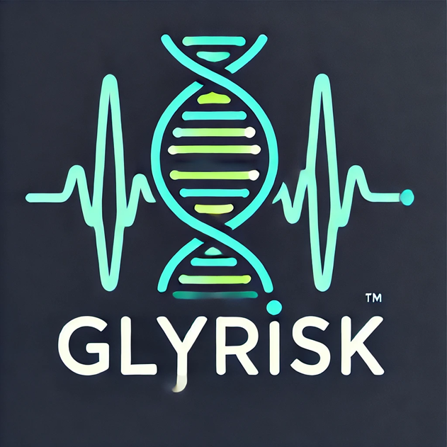

  
  <h1 style="margin-left: 20px;">ANR GLYRISK Project</h1>

*Website under development - Bilingual site (English/French) coming soon*

## About

GLYRISK *(Genetics of glycemic risk and chronic complications of type 1 diabetes and inference of their causal links)* aims at identifying glycemic risk signatures of developing chronic complications in type 1 diabetes (T1D) by leveraging the multicentric French-speaking Society of T1D. We will investigate these signatures at the genetic, molecular and cellular levels. Ultimately, we will use Mendelian Randomization to infer the causal impact of these signatures on T1D complications.

**Website:** [https://GLYRISK.github.io](https://GLYRISK.github.io)

## Asbtract
Type 1 diabetes (T1D) affects millions worldwide, leading to life-threatening complications, especially cardiovascular (CV) events that are more prevalent than in the general population or in patients with type 2 diabetes. Current understanding links poor glycemic control, measured by glycated hemoglobin (HbA1c), to chronic complications. Supported by observational studies, hyperglycemia is a suspected cause of CV adverse effects, likely through inflammatory processes, but clear causal links remain elusive. However, traditional metrics like HbA1c overlook day-to-day glycemic fluctuations, termed glycemic variability. Modern continuous glucose monitoring devices introduced new glycemic metrics, offering a more complete view of glycemic patterns. Despite the potential of these new metrics, the exact correlation between them and T1D complications remains unclear.
Thus, our study aims to infer the causal impact of glycemic risk signatures (GRSs) on T1D health events, especially CV complications. It will employ Mendelian Randomization (MR) to establish causal links, mimicking randomized controlled trials, using genetic variants as instrumental variables. To achieve this, we will leverage the new multi-centric French cohort ‘SFDT1’ rich glycemic data and biobanking capabilities. Each work package contributes specific genetic, molecular, and causal insights. Our objectives include defining GRSs by dissecting the correlation between glycemic traits, identifying genetic variants, molecular and cellular biomarkers associated with these signatures, and using MR to assess the direct impact of glycemic risk on T1D health events, especially CV complications. 
GLYRISK offers a unique opportunity to establish causal links, differentiating it from other observational studies. By exploring the genetic and molecular underpinnings of GRSs and complications, it aims to shed light on pathological mechanisms and to pave the way for more targeted T1D treatments and interventions.

## Team

- **Principal Investigator:** [Claire VANDIEDONCK, Université Paris Cité, Institut Necker Enfants Malades]
- **Partners:** 
  - Claire VANDIEDONCK [INSERM U1151 INEM]
  - Amélie BONNEFOND [INSERM - EGID]
  - Marie VERBANCK [INSTITUT CURIE]

## Funding

This project is funded by the French National Research Agency (Agence Nationale de la Recherche - ANR).

## Contact

For more information: [claire.vandiedonck@inserm.fr]

---

## License
- **Code:** MIT License
- **Graphics & Logo:** All rights reserved - GLYRISK Project
